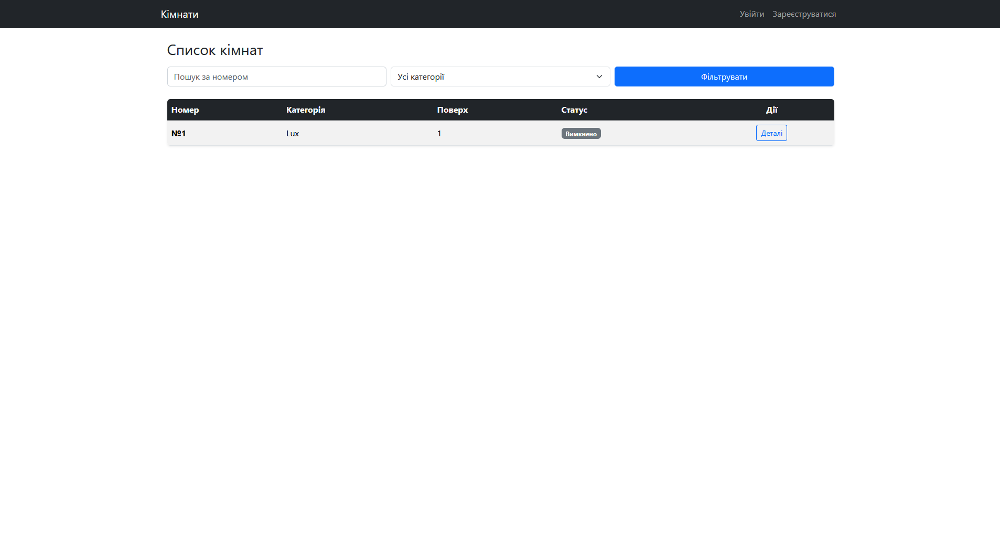
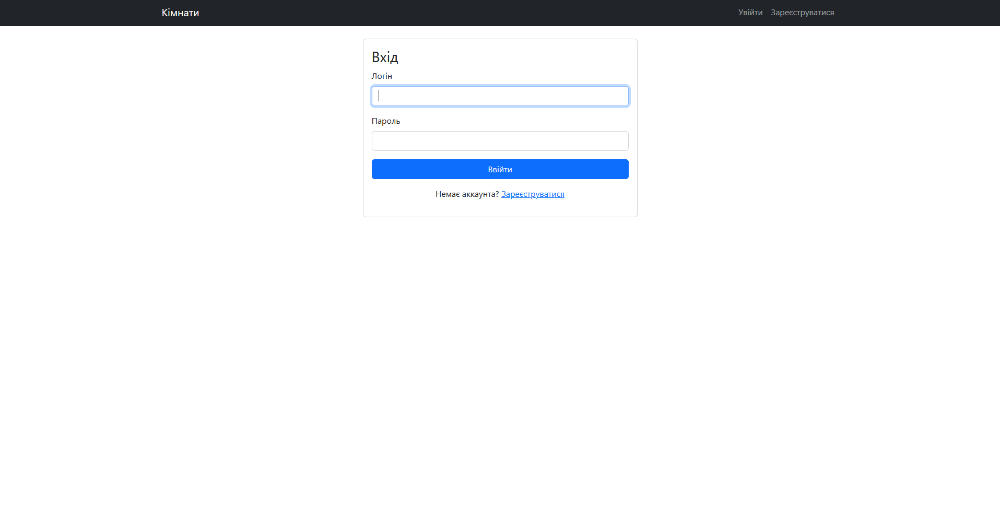
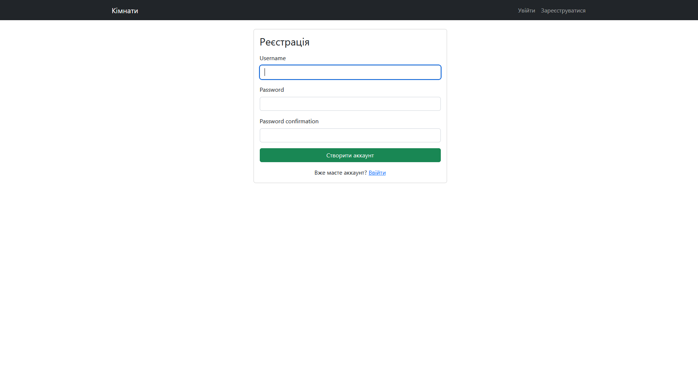
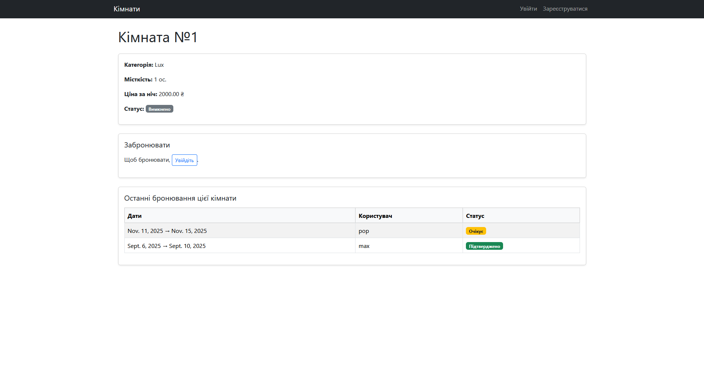

# Booking (Django)

  
  
  

---

## 📌 Опис
**Booking** – веб-додаток для бронювання на Django. Користувачі можуть переглядати кімнати, бронювати їх та відстежувати свої бронювання.  

---

## ⚙️ Функціонал
- Авторизація та реєстрація  
- Перегляд та пошук об’єктів  
- Деталі об’єкта з можливістю бронювання  
- Особистий кабінет користувача  

---

## 📂 Структура

booking/django_booking/booking_site/
-/booking_app/ # Основний застосунок
-/booking_site/ # Налаштування Django
-/templates/ # HTML-шаблони
-/static/ # CSS, JS, зображення
-/db.sqlite3
-/manage.py
-/requirements.txt

---

## 🖼️ Скріншоти
  
  
  
  

---

## 📦 Пакети (requirements)

Django==5.2.6;
asgiref==3.9.1;
django-widget-tweaks==1.5.0;
sqlparse==0.5.3;
tzdata==2025.2;

---

## 🚀 Запуск
```bash
# Клонувати репозиторій
git clone https://github.com/username/booking.git
cd booking

# Створити та активувати віртуальне середовище
python -m venv .venv
# Windows
.venv\Scripts\activate
# Linux/Mac
source .venv/bin/activate

# Встановити залежності та виконати міграції
pip install -r requirements.txt
python manage.py migrate

# Створити суперкористувача для адмінки
python manage.py createsuperuser

# Запустити сервер
python manage.py runserver

# Відкрити в браузері
http://127.0.0.1:8000/
```
